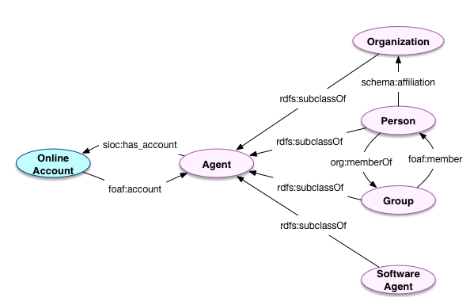

# Agents and Accounts

## Introduction

Agents are a key class within the Hydra in a Box Model. Agents represent real entities and may have associated Accounts used for authentication. Agents can act on resources in the repository (i.e. authenticated users in the repository application) or act on resources outside the context of the repository (i.e. physical/analog resource creators, publishers, contributors, agents depicted in the resource, etc.).

There are four possibilities for including agents in repository object metadata, enumerated below:

1. keep Agents as a Class, but always an externally-managed resource for instance data (i.e. each new field that expects an Agent instance will take a URI for an external to the repository system that represents the Agent - id.loc.gov, ULAN, local systems, etc.)
2. keep Agents as a Class, but always an internally-managed resource for instance data (i.e., the underlying Fedora instance will manage all Agent instances, and relations to external system URIs will be synced through sameAs assertions on the Fedora-managed Agent resources).
3. keep Agents as a Class, and could be externally or internally managed URIs (if no external URI, create an internal resource/URI).
4. captured Agent information through a datatype property / string literal field on the digital repository object resources (following many repositories' current practice).

Another option: Follow the VIVO model and create VCard resources for Agent entries which have very little information / could or probably will become better defined Agent resources in the future (or don't matter).

Pros/cons of these are discussed in the Implementation of Context Classes document.

Compare to [Authorities Vitro Pilot](https://github.com/cul-it/lts-vitro-pilot/wiki#foafperson--madsrdfauthority) work?

## Model



### Agents

#### `foaf:Agent`

Entailment with `prov:Agent` (when used with `prov:actedOnBehalfOf`).

**NOTE:** This is the expected superclass of all agents.

| Field            | Predicate                | Recommendation                     | Expected Value                    |
| ---------------- | ---------------------    | ---------------------------------- | --------------                    |
| *Label*          | `rdfs:label`             | MUST (unless `foaf:name` supplied) | Literal                           |
| *Preferred Name* | `foaf:name`              | SHOULD                             | Literal                           |
| *Alternate Name* | `schema:additionalName`  | MAY                                | Literal                           |
| ---------------- | ------------------------ | ---------------------------------- | --------------------              |
| *Email*          | `foaf:mbox`              | MAY                                | Literal                           |
| *Homepage*       | `foaf:homepage`          | MAY                                | URL                               |
| *About*          | `dcterms:description`    | MAY                                | Literal                           |
| *Identifier*     | `bf:identifiedBy`        | SHOULD (if applicable)             | [`bf:Identifier`](identifiers.md) |
| *Has account*    | `foaf:account`           | SHOULD (if applicable)             | `foaf:OnlineAccount`              |


#### `foaf:Person < foaf:Agent`

Entailment with `schema:Person` through `schema:` predicates.

| Field            | Predicate                | Recommendation                     | Expected Value       |
| ---------------- | ------------------------ | ---------------------------------- | -----------------    |
| *Label*          | `rdfs:label`             | MUST (unless `foaf:name` supplied) | Literal              |
| *Preferred name* | `foaf:name`              | SHOULD                             | Literal              |
| *Family name*    | `foaf:familyName`        | MAY                                | Literal              |
| *Given name*     | `foaf:givenName`         | MAY                                | Literal              |
| *Alternate name* | `schema:additionalName`  | MAY                                | Literal              |
| *Prefix*         | `schema:honorificPrefix` | MAY                                | Literal              |
| *Suffix*         | `schema:honorificSuffix` | MAY                                | Literal              |
| ---------------- | ------------------------ | ---------------------------------- | -----------------    |
| *Gender*         | `foaf:gender`            | MAY                                | Literal              |
| *Birthdate*      | `schema:birthDate`       | MAY                                | Date                 |
| *Birth place*    | `schema:birthPlace`      | MAY                                | `edm:Place`          |
| *Date of death*  | `schema:deathDate`       | MAY                                | Date                 |
| *Place of death* | `schema:deathPlace`      | MAY                                | `edm:Place`          |
| *Nationality*    | `schema:nationality`     | MAY                                | Literal              |
| ---------------- | ------------------------ | ---------------------------------- | -----------------    |
| *Knows*          | `foaf:knows`             | MAY                                | `foaf:Person`        |
| *Affiliation*    | `schema:affiliation`     | MAY                                | `foaf:Organization`  |
| *Member of*      | `org:memberOf`           | MAY                                | `foaf:Group`         |


#### `foaf:Group < foaf:Agent`

Entailment with `vcard:Group` when used with `acl:agentGroup` (see [permissions](permissions.md)).

| Field            | Predicate                | Recommendation                     | Expected Value       |
| ---------------- | ------------------------ | ---------------------------------- | -----------------    |
| *Label*          | `rdfs:label`             | MUST (unless `foaf:name` supplied) | Literal              |
| *Preferred name* | `foaf:name`              | SHOULD                             | Literal              |
| *Has member*     | `foaf:member`            | MAY                                | `foaf:Agent`         |


#### `foaf:Organization < foaf:Agent`

| Field            | Predicate                | Recommendation                     | Expected Value       |
| ---------------- | ------------------------ | ---------------------------------- | -----------------    |
| *Label*          | `rdfs:label`             | MUST (unless `foaf:name` supplied) | Literal              |
| *Preferred name* | `foaf:name`              | SHOULD                             | Literal              |


#### `hybox:SoftwareAgent < foaf:Agent`

```turtle
@prefix hybox: <http://example.org/hybox/ns#>

hybox:SoftwareAgent a rdfs:Class ;
    rdfs:label "Software Agent" ;
    rdfs:subclassOf foaf:Agent ;
    owl:equivalentClass prov:SoftwareAgent .
```

| Field            | Predicate                | Recommendation                     | Expected Value       |
| ---------------- | ------------------------ | ---------------------------------- | -----------------    |
| *Label*          | `rdfs:label`             | MUST (unless `foaf:name` supplied) | Literal              |
| *Preferred name* | `foaf:name`              | SHOULD                             | Literal              |


### Accounts

**NOTE:** Accounts are included in the model for completeness, but there is no assumption that they will be implemented as repository objects. Accounts may be managed in a separate database or application.

#### `foaf:OnlineAccount`

Entailment with `sioc:UserAccount` (through `sioc:account_of`).

| Field            | Predicate                | Recommendation                     | Expected Value       |
| ---------------- | ------------------------ | ---------------------------------- | -----------------    |
| *Label*          | `rdfs:label`             | SHOULD                             | Literal              |
| *Account name*   | `foaf:accountName`       | MUST                               | Literal              |
| *Account of*     | `sioc:account_of`        | MUST (if applicable)               | `foaf:Agent`         |


## Usage

### Defining New Agents and Accounts

A new Agent SHOULD be declared as an instance of a subclass of `foaf:Agent`, rather than explicitly as an instance of `foaf:Agent` itself.

```turtle
</groups/group0> a foaf:Group ;
    rdfs:label "Radical reformers" .

</agents/agent0> a foaf:Person ;
    rdfs:label "Thomas Müntzer" ;
    org:memberOf </groups/group0> .

</accounts/tmuentzer> a foaf:OnlineAccount ;
    foaf:accountName "tmuentzer" ;
    sioc:account_of </agents/agent0> .
```


### References to Agents

#### From RWOs

* dcterms:creator
* dcterms:contributor
* dcterms:publisher
* dcterms:rightsHolder
* MARC Relators: http://id.loc.gov/vocabulary/relators.html


#### From Other Agents

* prov:actedOnBehalfOf (note: domain is prov:Agent)