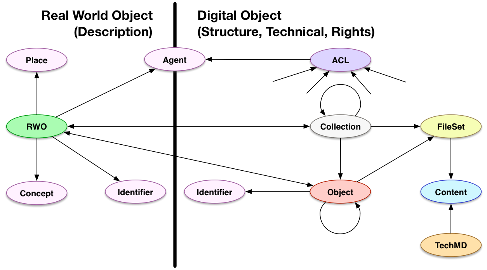

# HyBox Models

## Aims and Scope

The aims of the HyBox modeling work is to provide a single coherent model in which the primary content types can be described. The design of the models follows several [design principles][principles] in an effort to be consistent and practical.  

The scope of the work is guided by the content types and is intended to be incremental in approach.  The first content types are intentionally different to ensure a reasonable baseline, and then as they are further refined, so too the model will be refined.  When subsequent content types are added, this will then provide an opportunity to assess the model holistically.  The models will include both repository object descriptions (technical, structural, administrative and rights metadata) as well as descriptions of the real world objects that they are surrogates for (descriptive metadata).  The separation is also intentional, and it is hoped will allow for future replacement of the descriptive metadata with other more appropriate or more domain specific metadata schemes.

## Overview

* The structure of the content is divided into Collections and Objects.  These can be nested to create hierarchies.
* A FileSet is used to maintain a grouping of original binary content, and its derivatives such as a master TIFF image, the JPG access copy, and the PNG thumbnail.
* Files are the actual bitstreams, and can be described by Technical Metadata.
* Permissions are handled via Web ACLs, which refer to an Agent (such as a Person) and grant authoritizations over actions that person can take.  ACLs can be associated with any resource, including both the structural linked data and the binary content Files.
* Real World Objects, such as the physical book that the scanned repository object represents, are separate from the repository object structure.  HyBox provides a minimal set of descriptive fields and relationships.
* Concepts, Agents, Places, and Identifiers are treated as the most important descriptive resources to share between descriptions.

The following diagram lays out the basic structure of the HyBox model:

## Specific Models

* [Object Structure][structure] (the structure of managed resources)
  * Collection
  * Object
  * FileSet
  * Content
  * Technical
* [Real World Objects][rwo] (links from managed resources to descriptions of real world objects)
* [Agents][agents] (identity and descriptions of people, organizations and software agents)
* [Permissions][permissions] (the interaction between managed resources and agents' actions)
* [Identifiers][identifiers] (the description of legacy, non-URI identifiers)
* [Places][places] (the description of places)
* [Concepts][concepts] (the description of genres, subjects, topics, and other "authorities")

## Namespaces

In all of the models referenced above the following namespace declarations are used:

| Prefix     | URI                                                  |
|------------|------------------------------------------------------|
| `acl:`     | http://www.w3.org/ns/auth/acl#                       |
| `bf:`      | http://id.loc.gov/ontologies/bibframe/               |
| `dc:`      | http://purl.org/dc/elements/1.1/                     |
| `dcmitype:`| http://purl.org/dc/dcmitype/                         |
| `dcterms:` | http://purl.org/dc/terms/                            |
| `dpla:`    | http://dp.la/about/map/                              |
| `edm:`     | http://europeana.eu/schemas/edm/                     |
| `pcdm:`    | http://pcdm.org/models#                              |
| `foaf:`    | http://xmlns.com/foaf/0.1/                           |
| `gen:`     | http://www.w3.org/2006/gen/ont#                      |
| `gn:`      | http://www.geonames.org/ontology#                    |
| `iana:`    | http://www.iana.org/assignments/relation/            |
| `ldp:`     | http://www.w3.org/ns/ldp#                            |
| `marcrel:` | http://id.loc.gov/vocabulary/relators/               |
| `ore:`     | http://www.openarchives.org/ore/terms/               |
| `org:`     | http://www.w3.org/ns/org#                            |
| `owl:`     | http://www.w3.org/2002/07/owl#                       |
| `prov:`    | http://www.w3.org/ns/prov#                           |
| `rdf:`     | http://www.w3.org/1999/02/22-rdf-syntax-ns#          |
| `rdfs:`    | http://www.w3.org/2000/01/rdf-schema#                |
| `schema:`  | http://schema.org/                                   |
| `sioc:`    | http://rdfs.org/sioc/ns#                             |
| `skos:`    | http://www.w3.org/2004/02/skos/core#                 |
| `webac:`   | http://fedora.info/definitions/v4/webac#             |
| `works:`   | http://pcdm.org/works#                               | 

[principles]: /notes/design_principles.md
[structure]: structure.md
[rwo]: rwo.md
[agents]: agents.md
[permissions]: permissions.md
[identifiers]: identifiers.md
[places]: places.md
[concepts]: concepts.md

